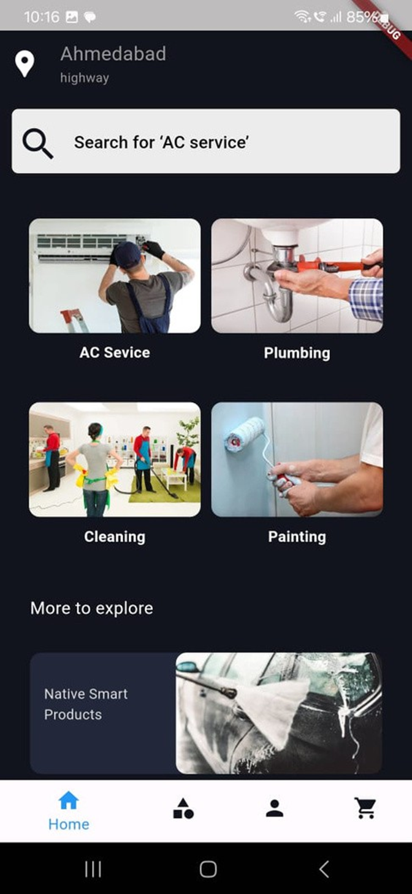
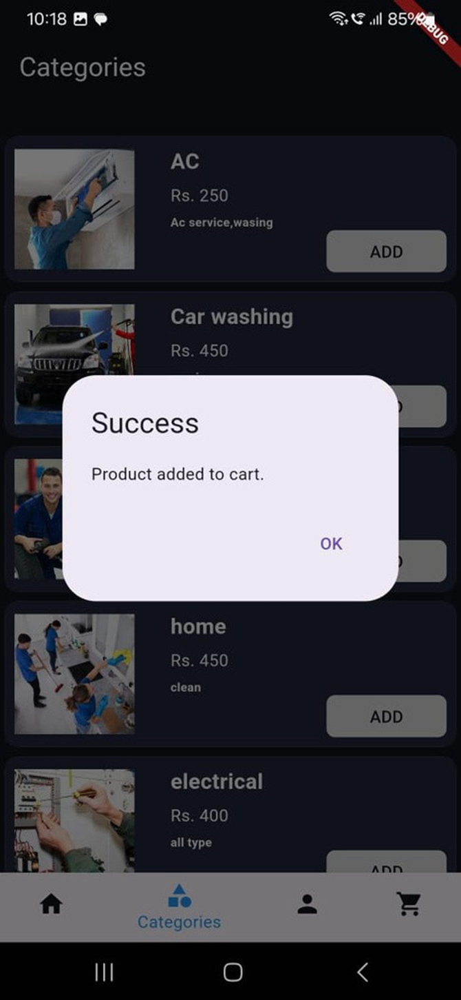
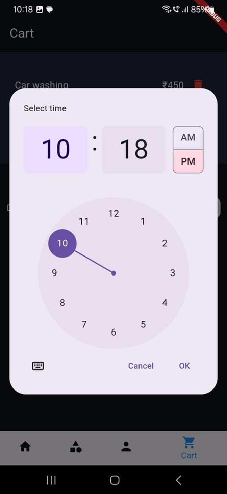
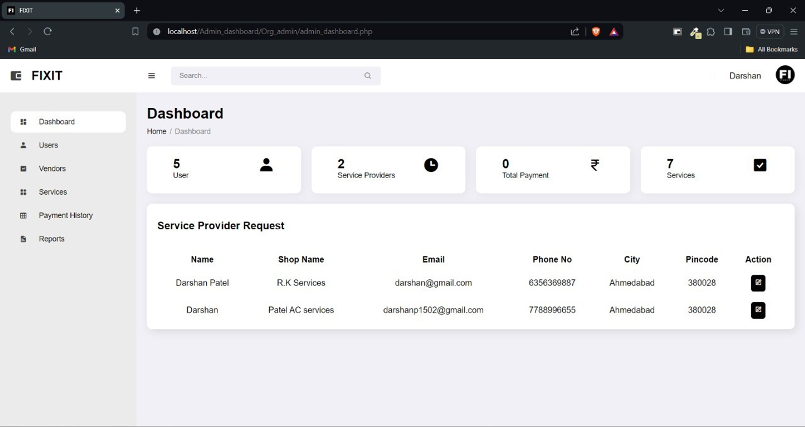

# Local Vendor Service App (Urban Company-like)

## Overview
This application is a service marketplace for local vendors, similar to **Urban Company**. It is built using **Flutter** to provide a cross-platform experience for both Android and iOS. The app allows users to book various services from local vendors, such as cleaning, beauty, repair services, and more.

## Features
- **Vendor registration**: Local service providers can register and offer their services.
- **Service Booking**: Users can browse and book services from registered local vendors.
- **Real-time tracking**: Users can track the status of their booked services.
- **Payment Gateway**: Integrated payment options for easy and secure payments.
- **Notifications**: Push notifications for booking updates and reminders.
- **Rating and Review system**: Users can rate and review services and vendors after completion.

## Screenshots

  
  
  

  

  

## Technologies Used
- **Frontend**: Flutter (Dart)
- **Backend**: MySQL,PHP
- **APIs**: Google Maps API
- **Authentication**: Firebase Authentication (OTP/Google Sign-in)

